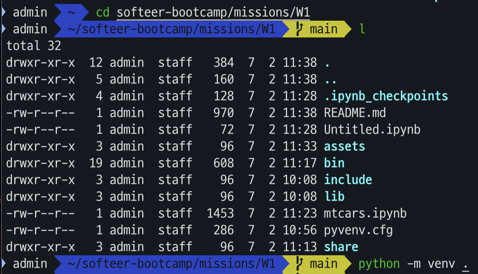
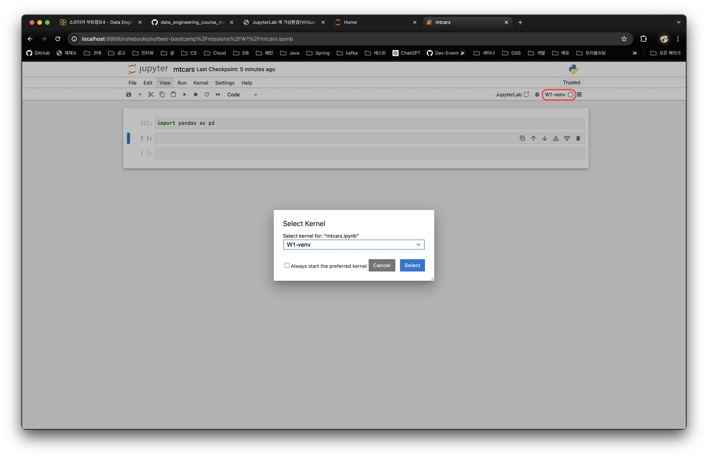
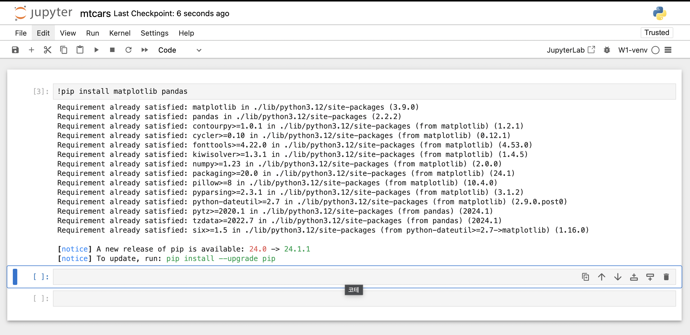

# Week1. 환경 설정

## 목차
1. [환경설정](#1-환경설정)
   - [pyenv 설치](#pyenv-설치)
   - [venv](#venv)
   - [jupyter lab, notebook 설치](#jupyter-lab-notebook-설치)
   - [jupyter notebook, venv에서 실행하기](#jupyter-notebook-venv에서-실행하기)
   - [부록](#부록)
   - [참고](#참고)

## 1. 환경설정

### pyenv 설치
>pyenv는 여러 python 버전을 한 컴퓨터에서 관리 및 사용할 수 있게 해준다.  
설치에는 다음의 링크를 참고하자.  
[GitHub-pyenv](https://github.com/pyenv/pyenv?tab=readme-ov-file#installation)  

어차피 구체적인 환경은 venv를 사용할 예정이므로, pyenv를 통해 설치하는 python은 Global로 설정해도 된다.  
```bash
pyenv global 3.12 # python@3.12를 global하게 사용(설치)
```  
<br>

### venv
>venv는 가상환경을 제공해서 워킹디렉토리 별로 python 버전 관리 및 의존성을 따로 관리할 수 있도록 해준다.  

<br>

### jupyter lab, notebook 설치
[Jupyter Install](https://jupyter.org/install)를 참고하여 주피터 랩과 노트북을 설치한다.  
<br>

### jupyter notebook, venv에서 실행하기
주피터를 이대로 실행하게 되면 Global로 설정된 pyenv를 사용하고 후에 설치하게 될 모든 의존성도 그곳에 모이게된다.  
이렇게 될 경우 venv의 이점을 다 누리지 못하므로 우리는 pyenv 대신 venv를 통해 주피터를 사용할 수 있게 설정한다.  
<br>
>pyenv(global)가 아닌 venv(local)에 패키지 설치하고 사용하기
파이썬이 어디서 실행되는지 알려면 간단하게 which를 사용해볼 수 있다.  
```
which python
```  
  
현재 global로 설정된 pyenv의 python@3.12를 찾아오고 있다.  
우리는 이를 venv로 교체한다.  
<br>
W1 폴더에 venv를 만들어준다.  
```bash
python -m venv <working-directory>
```
  
<br>
가상환경을 활성화한다.  
```bash
source <working-directory>/bin/activate
```
  
<br>
이제 주피터 노트북과 venv를 연결해줘야 한다.  
ipykernel을 설치하자.   
- ipykernel도 가상환경 밑에 설치되도록, activate 이후 설치한다.  
```bash
pip install ipykernel
```
<br>

커널을 하나 만들어준다. 추가할 가상환경과 주피터에서 display할 이름을 정의한다.  
```bash
python -m ipykernel install --user --name [가상환경폴더] --display-name [Jupyter에서 보여질 이름]
# python -m ipykernel install --user --name W1 --display-name W1-venv
```

<br>

주피터 실행 후 ipynb 파일을 생성하고 커널을 변경한다.  
  

<br>

새로운 패키지를 설치해보고 올바른 위치(venv)에 깔리는지 확인하자.  
    

<br>

#### 부록.
현재 존재하는 커널 리스트를 확인하고 삭제하는 방법  
```bash
# List all kernels and grap the name of the kernel you want to remove
jupyter kernelspec list
# Remove it
jupyter kernelspec remove <kernel_name>
```  

<br>

##### 참고.
[JupyterLab 에 가상환경(Virtualenv) 연결, 삭제하기
](https://raki-1203.github.io/jupyter/JupyterLab_venv_add_delete/)


