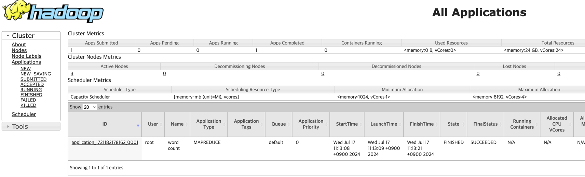
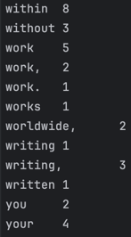

## Building the Docker image

`docker build -t base ./base`
`docker build -t master ./master`
`docker build -t worker ./worker`

base, master, worker 디렉토리 안에 있는 Dockerfile를 사용하여 각각 base, master, worker 태그로 
도커 이미지를 빌드합니다.

## Running the container
`docker compose up -d`

docker-compose.yaml 파일이 있는 디렉토리에서 위 명령어를 사용하여 도커 컨테이너를 실행합니다.

`docker-compose up -d`

OS나 버전에 따라 위 명령어를 사용 해야 할 수 도 있습니다.

## Performing HDFS operations

마스터 노드에서 hadoop 명령어를 편하게 실행하기 위해 alias를 설정합니다.
alias를 사용 할 수 없다면 `hadoop` 명령어를 `docker exec master-container /opt/hadoop/bin/hadoop`
로 대체합니다

`alias hadoop="docker exec master-container /opt/hadoop/bin/hadoop"`

### HDFS 디렉토리 생성

hdfs에 test용 디렉토리를 생성

`hadoop fs -mkdir -p /tmp/test/wordcount`

### 파일 저장.

LICENSE.txt 파일을 hdfs의 wordcount 디렉토리 아래에 저장합니다.

`hadoop fs -put /opt/hadoop/LICENSE.txt /tmp/test/wordcount`

### Wordcount mapreduce job 생성

샘플 mapreduce를 실행합니다 wordcount는  LICENSE.txt 파일의 단어들을
센 후 /tmp/test_out 디렉토리에 저장합니다.

`hadoop jar /opt/hadoop/share/hadoop/mapreduce/hadoop-mapreduce-examples-3.3.6.jar wordcount /tmp/test/wordcount /tmp/test/wordcount_out`

정상적으로 실행된다면 아래 [web ui](http://localhost:9870/)를 통해
mapreduce 작업이 돌아가고 있는 것을 확인할 수 있다.

## mapreduce 결과 확인

`hadoop fs -cat /tmp/test/wordcount_out/\*`

mapreduce 결과물은 wordcount_out 디렉토리 내에 part-r-0000* 과 같이 저장됩니다.

명령어를 통해 결과를 출력 할 수 있습니다.

## Hdfs에서 파일 다운로드

`hadoop fs -get /tmp/test/wordcount/LICENSE.txt LICENSE_copy.txt`

wordcount 용으로 hdfs에 업로드한 파일을 다운로드 합니다.
다운로드한 파일은 도커 컨테이너 내에 존재하므로 `docker cp` 와 같은 명령어로 호스트 머신으로
복사해서 사용 할 수 있습니다.

## Access the HDFS web interface

hdfs 웹 UI : http://localhost:9870/

클러스터 상태 : http://localhost:8088/