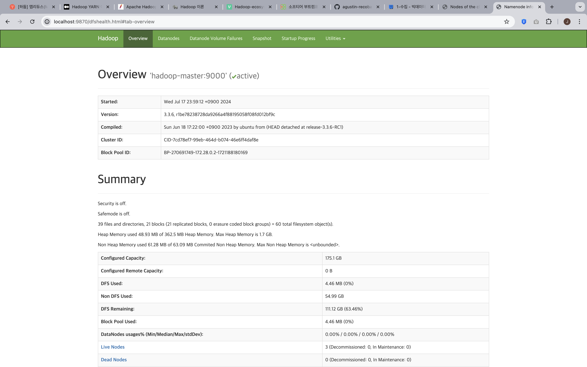
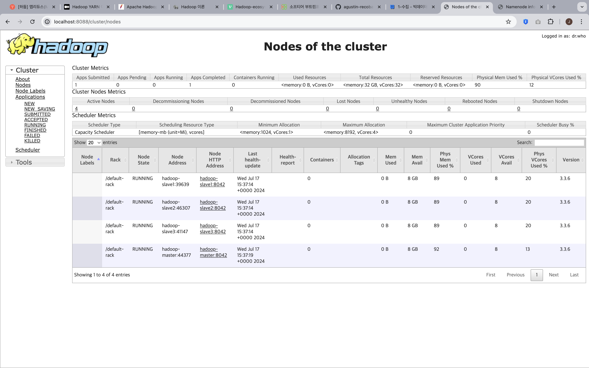

# M2-a: Cluster Setup

## Docker Build and Run

```bash
docker compose up -d
```

## Container access

```bash
docker exec -it hadoop-master /bin/bash
```

- master node 접속

## Web UI




## Component Check

```bash
jps
```

## Check Connection

```bash
ssh hadoop-slave1
```

hadoop-master에서 실행 시 hadoop-slave1에 접속할 수 있다.

- jps 명령어를 통해 각각의 master, slave 별로 떠 있는 구성요소를 확인할 수 있다.
  이는 java virtual machine 목록을 보여주는 명령어이다.

# HDFS Operation

## File put

```bash
hdfs dfs -put input.txt /w3/m2/
```

## File Replication 확인(Distributed 확인)

```bash
hdfs fsck /w3/m2/input.txt -files -blocks -locations
```

## MapReduce Job

```bash
hadoop jar /usr/local/hadoop/share/hadoop/mapreduce/hadoop-mapreduce-examples-*.jar wordcount /w3/m2/input.txt /w3/m2/output
```

## Result

```bash
hdfs dfs -cat /w3/m2/output/part-r-00000
```

<details>
<summary>result output</summary>
<div markdown="1">
And     11
God     13
In      1
Let     4
Now     1
So      1
Spirit  1
The     1
Then    1
a       1
above   1
according       3
and     14
appear. 1
be      3
bear    1
bearing 2
beginning       1
between 1
called  5
created 1
darkness        2
darkness.       1
day,    1
day.    3
deep,   1
dry     2
earth   1
earth.  1
empty,  1
evening,        3
first   1
formless        1
from    3
fruit   2
gathered        2
good,   1
good.   2
ground  2
he      3
heavens 1
hovering        1
in      2
it      6
it,     1
it.     1
kinds   1
kinds.  2
land    3
land,   1
let     1
light   3
light,  1
light.  1
made    1
morning 3
night.  1
of      2
on      1
one     1
over    2
place,  1
plants  2
produce 1
produced        1
said,   4
saw     3
seas.   1
second  1
seed    3
seed-bearing    1
separate        1
separated       2
sky     1
sky.    1
so.     3
surface 1
that    4
the     28
their   3
there   9
third   1
to      5
trees   2
under   2
various 1
vault   4
vegetation:     2
was     16
water   4
water.  1
waters  2
waters. 1
with    2
</div>
</details>

## Retriev File

```bash
hdfs dfs -get /w3/m2/output/part-r-00000 /root/softeer/w3/m2/
```

# M2-b: Configuration

```bash
docker compose up -d
```

## Container access

```bash
docker exec -it hadoop-master /bin/bash
```

## Modify Configuration

```bash
cd /usr/local/bin
```

```bash
./modify_hadoop_config.sh /opt/hadoop/etc/hadoop/
```

- config 파일 설정을 바꾸면 hadoop의 구성요소들이 정상적으로 돌아가지 않는다.

## Verify Configuration

```bash
./verify_hadoop_config.sh
```

## Rollback

```bash
./rollback.sh /opt/hadoop/etc/hadoop/
```

- hadoop의 정상적인 동작을 위해서 롤백
