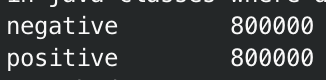

# Download Data

[kaggle twitter data](https://www.kaggle.com/datasets/kazanova/sentiment140)

# Put File on Container

```bash
docker cp mapper.py hadoop-master:usr/local/hadoop/mapreduce/twitter
docker cp reducer.py  hadoop-master:usr/local/hadoop/mapreduce/twitter
docker cp twitter_sentiment.csv hadoop-master:usr/local/hadoop/mapreduce/twitter/input
```

```bash
chmod 777 mapper.py reducer.py
```

# Put File on HDFS

```bash
hdfs dfs -put twitter_sentiment.csv /mapreduce/twitter/input
```

# MapReduce

## Run

```bash
hadoop jar /usr/local/hadoop/share/hadoop/tools/lib/hadoop-streaming-3.3.6.jar \
    -input /mapreduce/twitter/input/twitter_sentiment.csv \
    -output /mapreduce/twitter/output \
    -mapper /usr/local/hadoop/mapreduce/twitter/mapper.py \
    -reducer /usr/local/hadoop/mapreduce/twitter/reducer.py \
    -file /usr/local/hadoop/mapreduce/twitter/mapper.py \
    -file /usr/local/hadoop/mapreduce/twitter/reducer.py
```

## Check

```bash
hdfs dfs -cat /mapreduce/twitter/output/part-00000
```



# Move Result to Local

```bash
hdfs dfs -get /mapreduce/twitter/output/part-00000 /usr/local/hadoop/mapreduce/twitter/output
```
